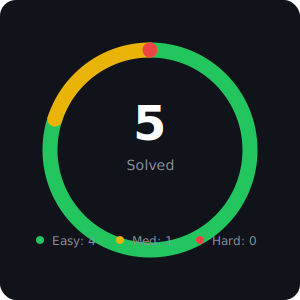

<!-- ALGOVAULT:STATS:START -->
# 🏆 AlgoVault Dashboard

> Auto-generated by [AlgoVault](https://github.com/algovault/extension) — Last updated: May 13, 2026

  

## 📊 Stats

| Metric | Value |
|--------|-------|
| Total solved | 4 |
| ✅ Easy | 3 |
| 🟡 Medium | 1 |
| 🔴 Hard | 0 |
| Current streak | 1 days |
| Longest streak | 1 days |
| Last solved | Pascals Triangle on May 13, 2026 |

## 📂 By Topic

| Topic | Count | % |
|-------|-------|---|
| Array | 3 | 75.0% |
| Dynamic Programming | 2 | 50.0% |
| uncategorized | 1 | 25.0% |
| Hash Table | 1 | 25.0% |

## 🕐 Recent Solutions

*See folders below for individual problem solutions.*

<!-- ALGOVAULT:STATS:END -->